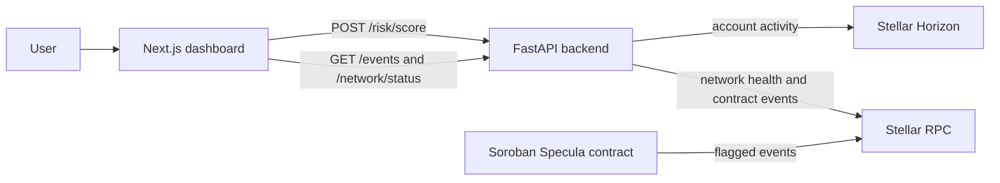

# Specula App

**A dashboard for screening Stellar account activity and reviewing Soroban contract flag events**

[](https://github.com/Specula-Labs/specula-app/actions/workflows/ci.yml)
[](LICENSE)
[](https://developers.stellar.org)
[](https://nextjs.org)
[](CONTRIBUTING.md)

Specula is a dashboard for screening Stellar account activity and reviewing Soroban contract flag events. Scores are transparent off-chain signals; they do not submit a transaction or create a contract flag.

## How it uses Stellar

The dashboard is a read-only window onto Stellar and Soroban, with no signing keys and no transactions of its own:

- **Stellar account screening** — submits a Stellar account id to the backend and renders the score, the signals behind it, and the account metrics drawn from Stellar Horizon.
- **Soroban contract flag feed** — renders the `flagged` events emitted by the [Specula contract](https://github.com/Specula-Labs/specula-contracts) and read through Stellar RPC, with cursor pagination over the event stream.
- **Network health** — shows the Stellar network identifier, Soroban RPC status, and latest ledger.
- **Explorer links** — account, contract, and transaction references link to the matching Stellar Expert explorer for the detected network.
- **Transparent signals** — scores are heuristic and off-chain; the UI states this explicitly rather than presenting them as verdicts.

## Table of Contents

- [How it uses Stellar](#how-it-uses-stellar)
- [Architecture](#architecture)
- [Stellar Testnet deployment](#stellar-testnet-deployment)
- [Project layout](#project-layout)
- [Prerequisites](#prerequisites)
- [Run locally](#run-locally)
- [Commands](#commands)
- [Configuration](#configuration)
- [API integration](#api-integration)
- [Security Notes](#security-notes)

## Architecture



The browser uses the backend as its only application API. It renders account metrics and signal explanations, the current network/RPC status, and a paginated contract event feed. If loading an older event page fails, already-loaded events remain visible and the failed cursor can be retried. The dashboard keeps up to five successful account assessments in the current page session so analysts can revisit recent results without storing them across reloads. The event feed requires a deployed contract ID configured in the backend.

## Stellar Testnet deployment

The backend is configured for the Specula contract at [`CCZAAZ3FJ7LKZA7E7A6EKQTU2HCNVI3YUVIHKWHSULGZSWAJFS2D2XVX`](https://stellar.expert/explorer/testnet/contract/CCZAAZ3FJ7LKZA7E7A6EKQTU2HCNVI3YUVIHKWHSULGZSWAJFS2D2XVX). The dashboard reads its Soroban events through `GET /events`. The contract is initialized at threshold 70; its feed is empty until an authorized agent records a flag. Deployment and transaction details are in the [contract README](https://github.com/Specula-Labs/specula-contracts#testnet-deployment).

## Project layout

- `app/page.tsx` — dashboard, account screening form, event feed, and section navigation.
- `app/globals.css` — responsive layout, sidebar/mobile navigation, and component styles.
- `app/layout.tsx` — document metadata and root layout.
- `.env.example` — frontend API URL for local development.

## Prerequisites

| Tool | Version / Notes | Install |
| --- | --- | --- |
| **Node.js** | 24 (the version used by CI), with npm | https://nodejs.org or `nvm use 24` |
| **Specula backend** | running locally or deployed; provides the screening, network, and event endpoints | see [specula-api](https://github.com/Specula-Labs/specula-api) |

No wallet, signing key, or Stellar CLI is required: the dashboard is read-only and talks only to the backend.

Verify your setup:

```bash
node --version   # v24.x
npm --version
```

## Run locally

Requires Node.js 24 (the version used by CI) and npm. Start the backend separately; see [specula-api](https://github.com/Specula-Labs/specula-api).

```bash
cp .env.example .env.local
npm ci
npm run dev
```

Open [http://localhost:3000](http://localhost:3000). `npm run start` serves a production build after `npm run build`.

## Commands

| Command | Purpose |
| --- | --- |
| `npm run dev` | Run the local Next.js development server. |
| `npm run lint` | Run ESLint across the frontend. |
| `npm run build` | Create a production build and check compilation/types. |
| `npm run start` | Serve the production build. |

There is no separate frontend unit-test suite configured yet. CI runs lint and build on pushes to `main` and pull requests.

## Configuration

Set `NEXT_PUBLIC_API_BASE_URL` in `.env.local` (default: `http://localhost:8000`). This value is exposed to the browser, so it must contain only a public API origin, never a secret. The backend's `CORS_ORIGINS` must include the frontend origin, normally `http://localhost:3000`.

## API integration

- `POST /risk/score` returns the account score, signals, metrics, data source, and observation time.
- `GET /events?limit=20&cursor=...` returns paginated contract events.
- `GET /network/status` reports the Stellar network, Soroban RPC health, and latest ledger.

When the backend identifies the network as Public Network or Testnet, account, contract, and available transaction references link to the matching Stellar Expert explorer. Unknown networks and missing transaction hashes remain plain text.

Keep response changes coordinated with the backend. Errors, loading, and empty states should remain explicit; do not replace missing chain data with sample values.

If a new account screening request fails after a successful assessment, the dashboard keeps the last successful result visible and shows the new request error above it.

## Security Notes

- **Read-only by design.** The dashboard holds no keys and submits no transactions; it calls the backend's application API only.
- **No secrets in the browser bundle.** Only `NEXT_PUBLIC_*` values are read, and all of them end up in the browser. Never put a secret in this application; anything sensitive belongs in the backend.
- **Public API origin only.** `NEXT_PUBLIC_API_BASE_URL` must be a public origin; the backend's `CORS_ORIGINS` must list this app's origin.
- **Scores are signals, not verdicts.** Nothing in this UI is proof of fraud or financial/compliance advice, and nothing here creates an on-chain flag.
- **No fabricated data.** Missing chain data is shown as an explicit empty or error state rather than replaced with sample values.
